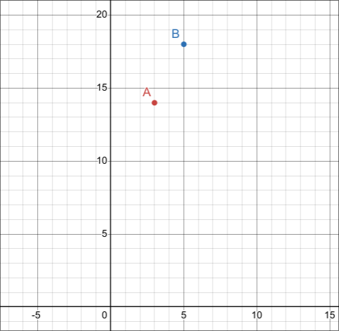
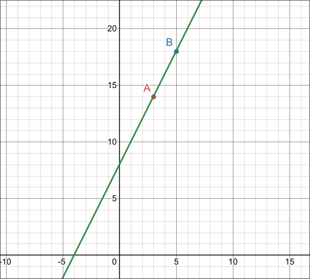

# Disclaimer
zrzekam się wszelkich praw do tej notatki, gdyż zawiera ona obrazy i/lub tekst z oryginalnego tekstu.

© Copyright by Oficyna Edukacyjna ∗ Krzysztof Pazdro Sp. z o.o.
Warszawa 2019 r.
Wydanie II/1, Warszawa 2023 r.

# Wprowadzenie
arti blagam cie wez ty sie na lekcjach ucz bo mi sie nie chce notatek pisac

ale jak juz musze to trudno

nie no wez ty sie bo mi tyle roboty dajesz ze no

dobra to tyle skibidi dododo jesjessss

# TEMAT 1 Proporcjonalność prosta
## zacznijmy od przykładziku
załóżmy, że chcemy kupić kilka niewolników na naszą plantację bawełny (każdy z nich sie nazywa Arti)

cena za jednego Artiego wynosi 2000 zł

zróbmy z tego funkcję, liczba Artich to X a cena za wszystkich to Y

| X (liczba artich) | Y (cena za wszystkich w zł |
| ----------------- | -------------------------- |
| 0                 | 0                          |
| 1                 | 2000                       |
| 2                 | 4000                       |
| 3                 | 6000                       |
| 4                 | 8000                       |

i tak dalej i tak dalej

no to tak wygląda proporcjonalność prosta co nie

to jest $x$ razy coś

w tym przypadku $f(x)=x \cdot 2000$

proste? to tera teoria
## definicja proporcjonalności prostej
Proporcjonalnością prostą nazywamy zależność między dwiema wielkościami
zmiennymi x, y, określoną wzorem $y = a ⋅ x$, gdzie a jest liczbą różną od zera,
zwaną współczynnikiem proporcjonalności.

dobra juz sie pogubilem bo ten podrecznik nie umie tlumaczyc

proporcjonalność prosta to po prostu $y=a\cdot x$ gdzie a nie jest zerem
nasze 'a' nazywa się ***współczynnik proporcjonalności***

krócej, łatwiej, i lepiej - rudy umie uczyc ez?

## kolejny przykladzik

| X   | Y   |
| --- | --- |
| -18 | -12 |
| -3  | -2  |
| 6   | 4   |
| 27  | 18  |
| 60  | 40  |
| 900 | 600 |

teraz sprawdzimy sobie czy to jest proporcjonalne wszystko i czy mamy *proporcjonalność prostą*

skoro $y=a*x$ to podzielmy $y$ przez $x$ i bedzie $a$
$$a=\frac{y}{x}$$

to teraz lecymy tak z każdym
$-12\div -18 = \frac{2}{3}$
$-2\div -3 = \frac{2}{3}$
$4\div 6 = \frac{2}{3}$
$18\div 27 = \frac{2}{3}$
$40\div 60 = \frac{2}{3}$
$600\div 900 = \frac{2}{3}$

we wszystkich nam daje takie samo a, czyli jest to proporcjonalność prosta

jest możliwe że tak nie będzie w jakims zadaniu
dla przykladu:

| x   | y   |
| --- | --- |
| 5   | 10  |
| 10  | 20  |
| 15  | 32  |
| 20  | 40  |
| 25  | 50  |
| 30  | 60  |
| 35  | 105 |

$10\div 5 = 2$

$20\div 10 = 2$

$32\div 15 = 2\frac{2}{15}$

$40\div 20 = 2$

$50\div 25 = 2$

$60\div 30 = 2$

$105\div 35 = 3$

przy $x=15$ i $x=35$ cos nie gra - wniosek oczywisty, ***nie ma*** *proporcjonalności prostej* w tym przypadku

idz rób zadania

# TEMAT 2 Funkcja liniowa. Wykres i miejsce zerowe funkcji liniowej
## definicja funkcji liniowej
bierzesz sobie z poprzedniego tematu proporcjonalność prostą $y=a\cdot x$ i dodajesz do tego $b$ I BOOM MASZ FUNKCJE LINIOWĄ $f(x)=a\cdot x + b$

(może być ujemne $b$, wtedy wzór jest $f(x)=a\cdot x-b$)

$b$ to dowolna liczba, ale nie moze w niej byc ani $x$ ani $y$ ani nic wgl tylko liczba. tak samo z $a$.

co nie znaczy, że $b$ albo $a$ nie może być na przykład pierwiastkiem albo ułamkiem, bo może (są to liczby rzeczywiste)

## wykres funkcji liniowej
jak chcesz sobie narysowac wykres funkcji liniowej to wyznacz sobie 2 punkty (mogą być kompletnie randomowe) dla przykladu wezmy $x_1=3$ oraz $x_2=5$

naszą funkcją liniową będzie $f(x)=2x + 8$

liczymy sobie $y$ (czyli $f(x)$) do tych punktów

$y_1 = f(x_1) = 2x_1 + 8 = 2\cdot 3 + 8 = 6 + 8 = 14$

$y_2 = f(x_2) = 2x_2 + 8 = 2\cdot 5 + 8 = 10 + 8 = 18$

czyli mamy dwa punkty, nazwijmy je $A$ i $B$, ich współrzędne to $A(3, 14)$ oraz $B(5, 18)$

to po prostu zaznaczasz te 2 punkty

i robisz z nich prostą łącząc je i robiąc z tego długą kreskę linijką

no i tyle w temacie

ciekawostka dla cb, najlatwiejsze punkty do robienia tego to nie są jakies z dupy tylko 0 oraz 1

pokażę ci na naszej funkcji $f(x)=2x + 8$ 

$f(0)=2x+8=2\cdot 0+8=8=b$

czyli $f(0)=b$ 

$f(1)=2x+8=2\cdot 1+8=2+8=a+b$ (w tym przypadku jest to $10$ jakbys liczyc nie umial)

czyli $f(1)=a+b$

***ZAPAMIĘTAJ!***

Dla **każdej** funkcji **liniowej** $f(x)=ax+b$:
$$
f(0)=b
$$

oraz

$$
f(1)=a+b
$$

Jest to prawdziwe dla **KAŻDEJ** funkcji **liniowej**. 

Jest to prawdziwe dla **KAŻDEJ** funkcji **liniowej**. 

Jest to prawdziwe dla **KAŻDEJ** funkcji **liniowej**. 

v

Jest to prawdziwe dla **KAŻDEJ** funkcji **liniowej**. 

v

vJest to prawdziwe dla **KAŻDEJ** funkcji **liniowej**. v

myślę że teraz zapamiętasz.

jeszcze pare rzeczy

jeśli a=0 to TYLKO WTEDY funkcja jest stała

jeśli a>0 to TYLKO WTEDY funkcja jest rosnąca

jeśli a<0 to TYLKO WTEDY funkcja jest malejąca

jeśli masz 2 punkty, nazwijmy je $A$ i $B$, które należą do tej funkcji, to

$$a=\frac{y_A-y_B}{x_A-x_B}$$

gdzie $x_A,y_A$ to współrzędne punktu A oraz $x_B,y_B$ to współrzędne punktu B

i jeszcze ostatnia rzecz:

jeśli masz narysowane proste dwóch funkcji liniowych, to one są do siebie równoległe WTEDY I TYLKO WTEDY, gdy ich $a$ jest sobie równe ($b$ mogą mieć dowolne, ono tylko zmieni ich odległość od siebie)

RÓB ZADANIA LECE DALEJ

# TEMAT 3 Własności funkcji liniowej – zadania różne

arti jestem zmęczony i nie bede sie rozpisywal, ale przejrzałem ten temat w podreczniku i jest dość łatwy do zrozumienia

strona 216 w podr jakby co

tam są po prostu przykładowe zadanka
# Podsumowanie

tbh nawet tego mi sie juz nie chce pisac padniety jestem plecki bolą xD za duzo csa

wiec milego 
